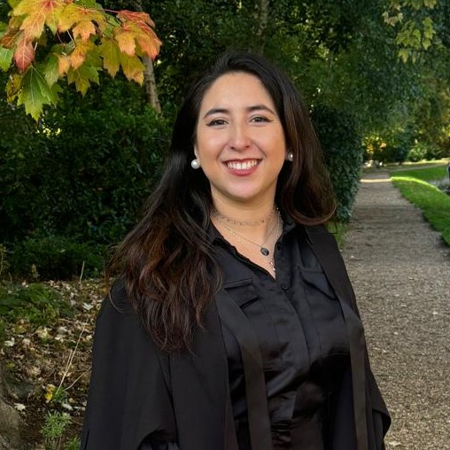

:::: {style="display:flex; align-items:center; gap:60px; margin-top:60px;"}

::: {style="max-width:520px;"}
## Natalia Cabrera-Morales

I am a Chilean [PhD candidate](https://www.crim.cam.ac.uk/people/natalia-cabrera-morales) in Criminology at the University of Cambridge, a lawyer, and hold a master's in Sociology and an Mphil in Criminological Research. 

:::
::::

I graduated from law in the top 10% of the cohort. I was the second best student of the MPhil in Criminological Research (2023-2024), being appointed as Manuel López-Rey proxime accesserunt, and an Emily Davis Scholar at Girton College. I studied my MPhil with a full scholarship from ANID-Cambridge trust and I am fully funded by Cambridge Trust for my PhD.

My [PhD research](phd.qmd) focuses on police misconduct but I am generally interested in criminal justice institutions. My supervisor is [Dr. Charles Lanfear](https://clanfear.github.io/).

Further [projects](research.qmd) involve gender violence and crimes against women. 

I am passionate about methodology, having experience in practice and teaching with both quantitative and qualitative methods. I am a mostly self-taught programmer, working in R and Python. However, one of my favourite academic activities is [teaching](teaching.qmd).

------------------------------------------------------------------------
