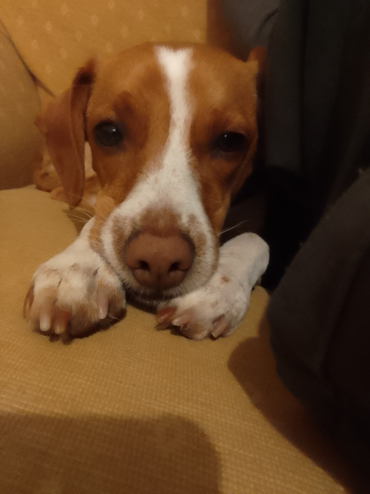
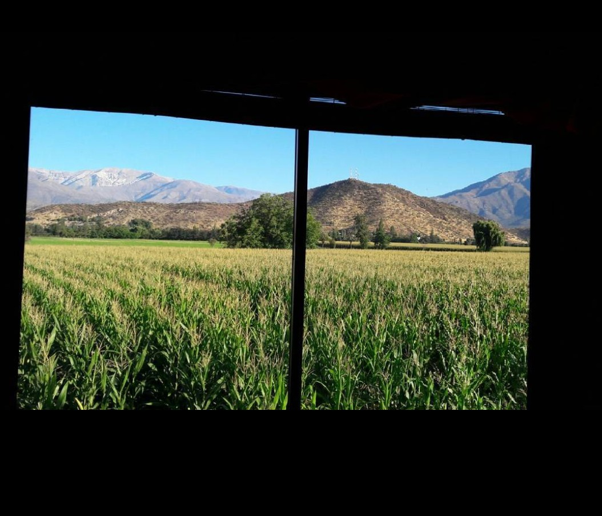
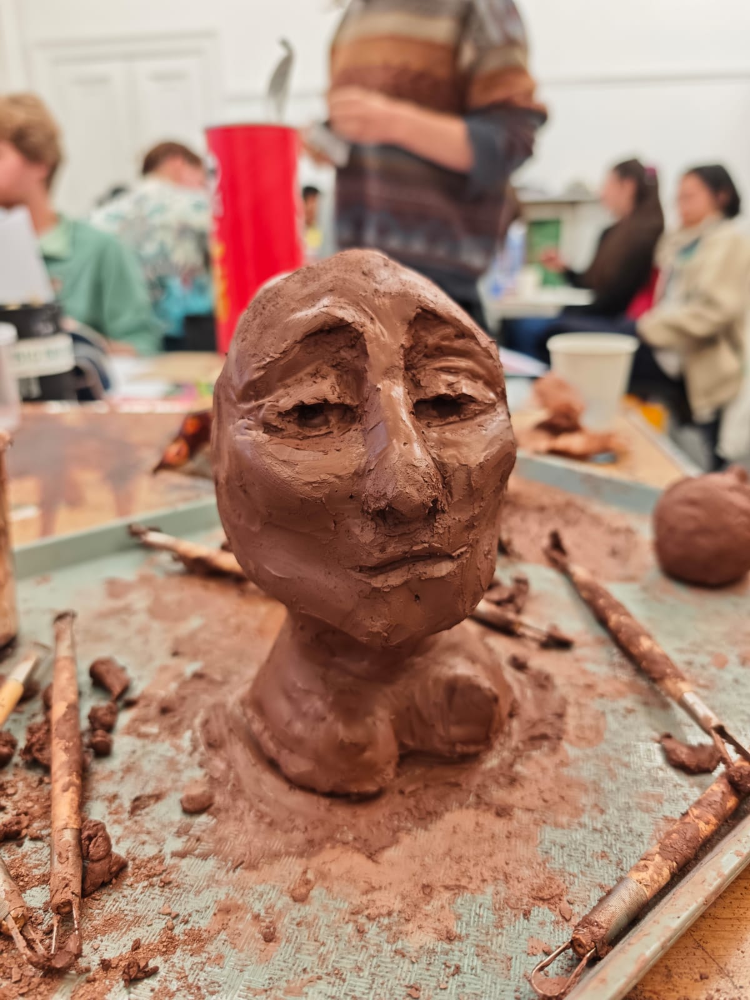
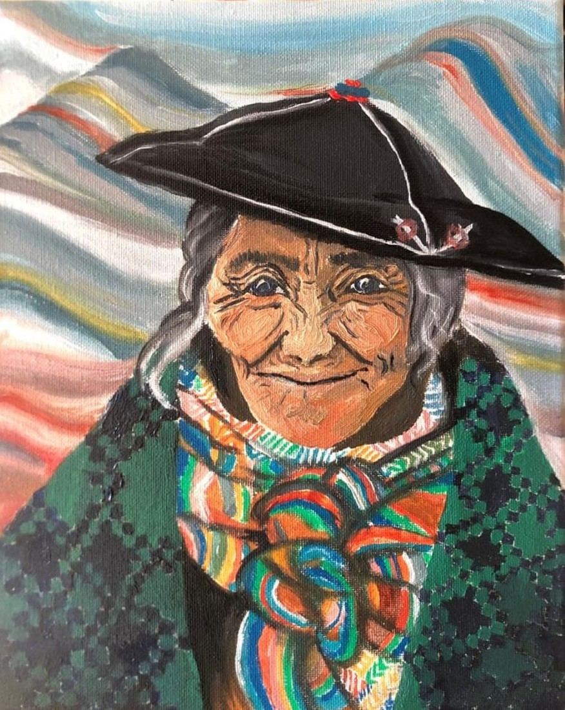
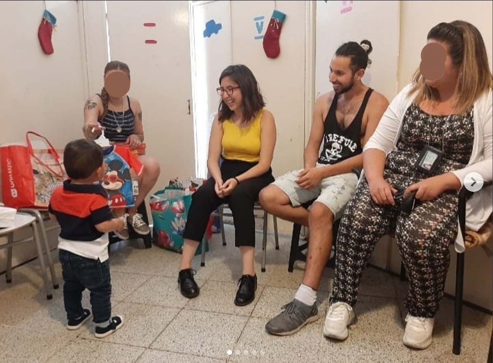
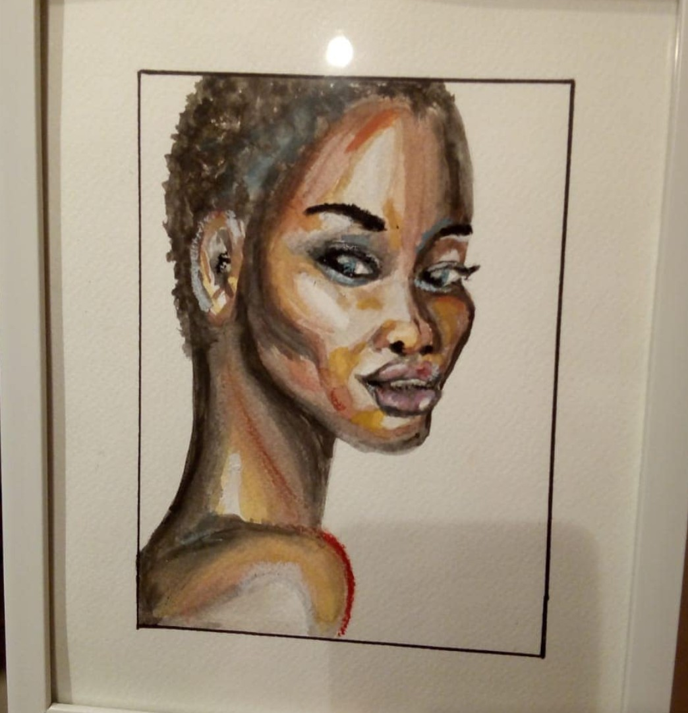
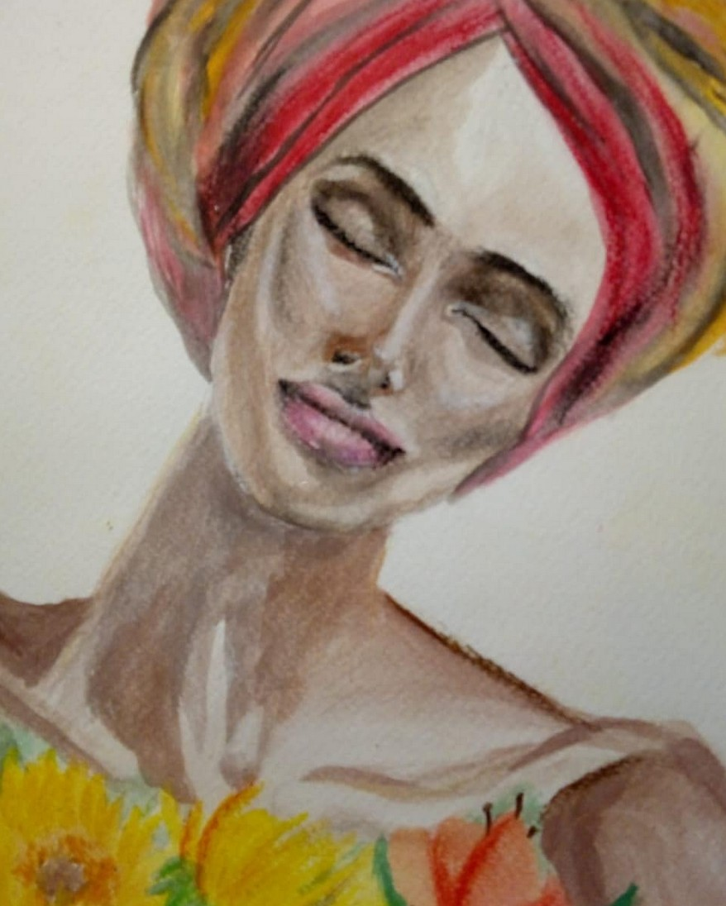

::: {style="display:flex; align-items:center; gap:60px; margin-top:60px;"}
 

I have a small dog whose name is Pasqui. She is my best friend and constant companion. 
I grew up between two countryside towns close to the mountains in Chile [Los Andes](https://en.wikipedia.org/wiki/Los_Andes,_Chile) and [Calle Larga](https://en.wikipedia.org/wiki/Calle_Larga). At 17 I moved to [Valparaíso](https://www.youtube.com/watch?v=yHb7M94qVHs) which I consider my hometown. My mom was a nutritionist in a rural health centre, so I grew up accompanying her at work and seeing her interact with her patients with care and interest. My mom was always the economic head of the household.
:::

:::: {style="display:flex; align-items:center; gap:60px; margin-top:60px;"}
::: {style="max-width:520px;"}
I also grew up hearing stories about conflict and political struggle, as my father was displaced from his home in Colombia as product of the conflict when he was 10. His mother used to write poems and paint. My favourite [poem](poem.qmd) of hers is about her experience with the early days of the conflict. My father also had to leave Chile back to Colombia during his youth as a consequence of the dictatorship.
:::

::::

::: {style="display:flex; align-items:center; gap:60px; margin-top:60px;"}
 

My research is influenced by my upbringing in many ways. But also by many other life experiences. During my undergrad I used to frequent the prison in Valparaíso to volunteer in a few projects, which for ever impacted my understanding of punishment and my perception of people in prison. Regarding the action of the police, I witnessed their behaviour frequently during protests in Chile. A few of my friends suffered torture and other forms of police violence. 
:::

:::: {style="display:flex; align-items:center; gap:60px; margin-top:60px;"}
::: {style="max-width:520px;"}
However, during my master's in Sociology I had the opportunity to interview several police officers. One of them was imprisoned being charged with torture. It struck me how sweet and conscientious he was. He had a calm and cheerful demeanour and cared about vulnerable people. The most prominent value underlying his discourse was service to society. All of these experiences have taught me the importance to honour the complexity of the world, avoid simplification and empathise with those who are frequently despised.

:::

::::

:::: {style="display:flex; align-items:center; gap:60px; margin-top:60px;"}

My volunteering and activism have included, several projects in the prison in Valparaíso, including coordinating the participation of prisoners in the constitutional discussion in 2017. In 2019 drafted a bill project to ban rubber bullets that was presented in the congress by the MP Jorge Brito Hasbún. Also in 2019, I presented a protection appeal to ban rubber bullets in Valparaíso (which was successful in first instance, and lead to their ban for a year). I created and coordinated an association of students of law to represent victims of harassment, abuse and discrimination in the university.
:::

Many books that never make it into my citations have changed deeply how I see the world. Among others: [Eichmann In Jerusalem](https://www.amazon.co.uk/Eichmann-Jerusalem-Banality-Twentieth-Classics/dp/0140187650), [Truth and Juridical Forms](https://www.amazon.co.uk/verdad-las-formas-juridicas/dp/8474320909), [An Invitation to Reflective Sociology](https://press.uchicago.edu/ucp/books/book/chicago/I/bo3649674.html), [King Kong Theory](https://www.amazon.co.uk/King-Kong-Theory-Virginie-Despentes/dp/1558616578), [Disgrace](https://www.amazon.co.uk/Disgrace-J-M-Coetzee/dp/0140296409), and [Waiting for the Barbarians](https://en.wikipedia.org/wiki/Waiting_for_the_Barbarians). Songs from Violeta Parra, Victor Jara, Silvio Rodríguez, Portavoz, Anita Tijoux, among others give me purpose when I forget I have one.

:::::: {style="display:flex; justify-content:center; gap:40px; margin-top:60px;"}
::: {style="text-align:center;"}

:::

::: {style="text-align:center;"}

:::
::::::

I sometimes paint or do clay in my free time. Some of the products are here.
